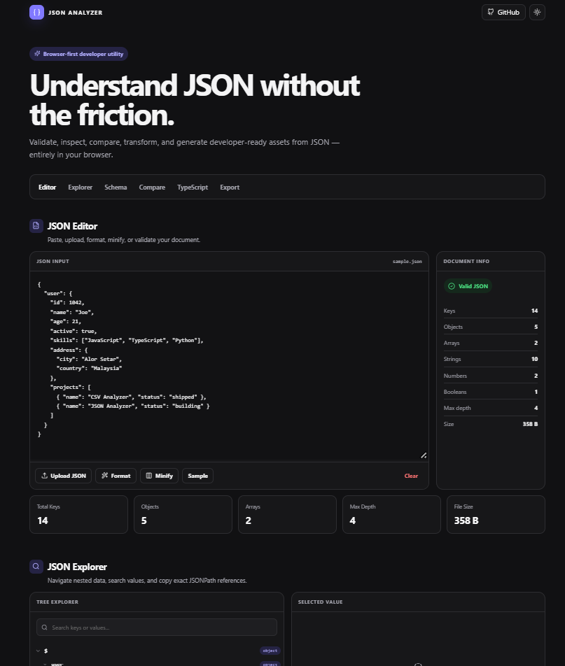
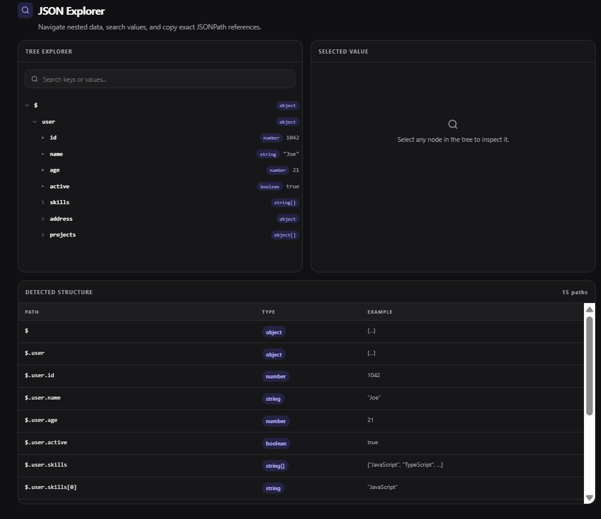
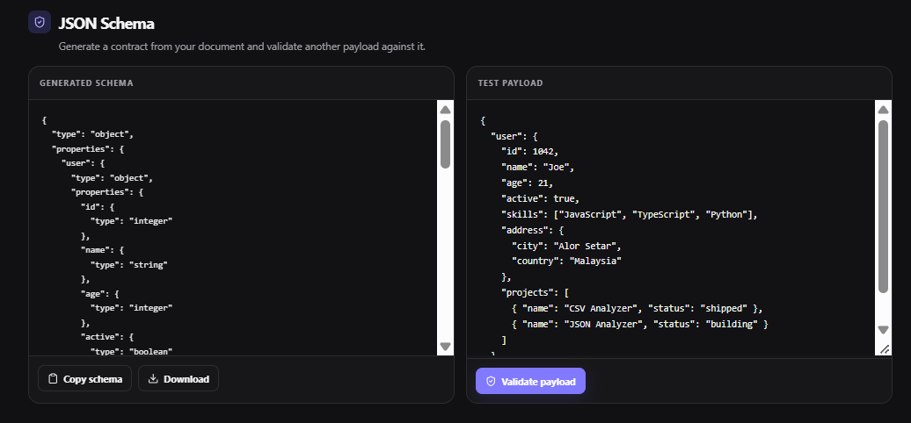
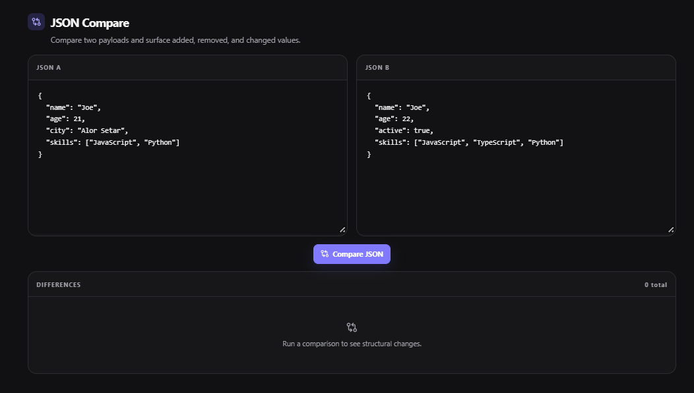

# JSON Analyzer Dashboard

A browser-based developer tool for validating, exploring, comparing, transforming, and exporting JSON data.

## Preview

### Main Dashboard



### JSON Explorer



### JSON Schema



### JSON Compare



## Features

| Feature | Description |
|---|---|
| JSON Validation | Detects valid and invalid JSON and displays parsing details when available |
| Format & Minify | Pretty-prints valid JSON or compresses it into a single line |
| JSON File Upload | Loads local `.json` files into the editor |
| Document Statistics | Reports keys, objects, arrays, primitive types, maximum depth, and file size |
| Tree Explorer | Browses nested objects and arrays through an expandable tree |
| JSONPath Explorer | Inspects a selected value and copies its exact JSONPath |
| Tree Search | Filters the tree by matching keys or values |
| Structure Detection | Lists detected paths, data types, and example values |
| JSON Schema | Infers a schema and validates another payload against it with AJV |
| JSON Compare | Detects added, removed, and changed values between two documents |
| TypeScript Generator | Infers TypeScript interfaces or types from JSON data |
| JSON to CSV | Converts compatible objects and arrays of objects into CSV |
| Export Tools | Copies or downloads JSON, CSV, TypeScript, and JSON Schema output |
| Local Processing | Processes JSON in the browser without a backend |
| Theme Support | Provides light and dark interface themes |

### Edit & Validate

Paste JSON into the editor or upload a local `.json` file. The dashboard parses changes immediately, reports whether the document is valid, and enables formatting or minification for valid input. It also calculates document statistics such as key count, data-type counts, nesting depth, and byte size.

### Explore

Navigate objects and arrays in the recursive tree explorer. Search across keys and value previews, select any node to inspect its type, parent, and depth, and copy its JSONPath. A separate structure table summarizes detected paths, types, and representative values.

### Schema Tools

Generate a JSON Schema from the current document. A second editor lets you test another JSON payload against the generated schema using AJV and review any validation errors.

### Compare

Paste two JSON documents into the comparison editors to find values that were added, removed, or changed. Differences include their paths and before/after values where applicable.

### Generate

Generate TypeScript definitions from the supplied JSON shape. The root type name is configurable, and nested objects are represented as separate interfaces.

### Export

Copy formatted or minified JSON, or download generated output as `.json`, `.csv`, or `.ts` files. The inferred JSON Schema can also be downloaded as a JSON file.

## Why This Project

JSON is common in application development, but reading and transforming complex payloads by hand can be slow and error-prone. This dashboard combines several practical workflows in one interface:

- Debug API responses and malformed JSON.
- Explore deeply nested objects and arrays.
- Compare payload versions or expected and actual results.
- Generate starter TypeScript models from representative data.
- Infer and test JSON structure contracts.
- Convert suitable JSON records into CSV.
- Export reusable JSON, schema, and TypeScript files.

## Tech Stack

| Technology | Purpose |
|---|---|
| Next.js | Application framework and production build tooling |
| React | Client-side interface and state management |
| TypeScript | Type-safe application and JSON utility development |
| CSS | Custom responsive layout, themes, and component styling |
| Lucide React | Interface icons |
| AJV | Local JSON Schema validation |

## Project Structure

```text
json-analyzer-dashboard/
├── app/
│   ├── globals.css        # Theme, layout, and responsive component styles
│   ├── layout.tsx         # Root HTML layout and page metadata
│   └── page.tsx           # Main client-side dashboard and feature UI
├── components/
│   └── JsonTree.tsx       # Recursive, searchable JSON tree explorer
├── lib/
│   ├── download.ts        # Browser file-download helper
│   └── json-tools.ts      # Parsing, statistics, schema, diff, type, and CSV utilities
├── public/
│   └── sample.json        # Example JSON file for testing uploads
├── BUILD-NOTES.md         # Existing build and utility-check notes
├── LICENSE                # MIT License
├── START-HERE.md          # Short local testing guide
├── next.config.ts         # Next.js configuration
├── package.json           # Dependencies and npm scripts
├── tsconfig.json          # TypeScript compiler configuration
└── README.md              # Project documentation
```

The `app` directory contains the page and its presentation layer. Reusable tree rendering lives in `components`, while parsing and transformation logic is kept in `lib`. The application does not contain server routes, database configuration, or authentication code.

## How It Works

```text
User JSON
    ↓
Browser editor or local file upload
    ↓
Parse and validate with JSON.parse
    ↓
Explore / compare / infer schema / generate TypeScript
    ↓
Copy results or export files in the browser
```

The main dashboard is a client component. JSON parsing, analysis, schema validation, transformation, and file generation happen in the browser. Downloads are created from browser `Blob` objects and do not require an upload service.

## Getting Started

### Prerequisites

- Node.js
- npm

### Installation

```bash
git clone https://github.com/chitko84/json-analyzer-dashboard.git
cd json-analyzer-dashboard
npm install
npm run dev
```

Open [http://localhost:3000](http://localhost:3000) in your browser.

## Available Scripts

| Command | Description |
|---|---|
| `npm run dev` | Starts the Next.js development server |
| `npm run build` | Creates an optimized production build |
| `npm run start` | Starts the built application in production mode |
| `npm run lint` | Runs the configured Next.js lint command |

Run `npm run build` before `npm run start`.

## How to Use

1. **Validate JSON:** Paste JSON into the input editor. The document status updates automatically and invalid input displays a parsing error.
2. **Format JSON:** Enter valid JSON and select **Format** to apply two-space indentation.
3. **Minify JSON:** Enter valid JSON and select **Minify** to remove unnecessary whitespace.
4. **Explore the tree:** Open the **Explorer** section and select object or array nodes to expand or collapse them.
5. **Search keys or values:** Use the tree search field to filter branches containing a matching key or value preview.
6. **Copy a JSONPath:** Select a tree node, then use **Copy path** in the selected-value panel.
7. **Generate JSON Schema:** Open **Schema** to review the automatically inferred schema for the current document.
8. **Validate another payload:** Edit the test payload in the Schema section and select **Validate payload**.
9. **Generate TypeScript:** Open **TypeScript**, optionally change the root type name, then copy or download the generated definitions.
10. **Compare JSON:** Add documents to the **JSON A** and **JSON B** editors, then select **Compare JSON**.
11. **Convert JSON to CSV:** Use **Convert to CSV** or the CSV export card when the current JSON is an object or an array of objects.
12. **Export files:** Open **Export** to copy output or download formatted JSON, CSV, TypeScript definitions, or JSON Schema.

## Example

Input JSON:

```json
{
  "user": {
    "name": "Joe",
    "age": 21,
    "skills": ["JavaScript", "TypeScript"]
  }
}
```

Selecting the first skill in the tree produces this JSONPath:

```text
$.user.skills[0]
```

With `Root` as the root type name, the TypeScript generator produces definitions in this form:

```ts
export interface Root {
  "user": RootUser;
}

export interface RootUser {
  "name": string;
  "age": number;
  "skills": string[];
}
```

The generated types reflect the values present in the supplied example rather than a separate contract.

## Privacy

JSON is processed locally in the browser and is not uploaded to a server by this application. The current project requires:

- No API key
- No database
- No backend service
- No authentication setup

As with any browser-based tool, only process data on devices and in environments you trust.

## Limitations

- Very large or deeply nested JSON documents may affect browser responsiveness.
- TypeScript output is inferred from the supplied values and may not represent every possible shape in a broader dataset.
- Array type inference uses the first array item for generated TypeScript definitions and JSON Schema items.
- JSON Schema is inferred from the current payload; object properties found in that payload are marked as required.
- Structure detection samples the first item of each array and displays up to 120 detected paths in the dashboard.
- JSON comparison is structural and does not support custom array matching or semantic comparison rules.
- JSON-to-CSV conversion requires an object or array of objects and is best suited to record-like data. Nested values are serialized into individual CSV cells.

## Future Improvements

The following are possible future additions and are not part of the current application:

- YAML input and output
- XML conversion
- Advanced JSONPath queries
- Optimized handling for large files
- Keyboard shortcuts
- Multi-file comparison

## Design

The dashboard uses a premium Porcelain-style visual system with a clean, light-first interface and subtle indigo accents. Developer-focused monospace typography is used for JSON and generated output, while restrained cards and borders keep the workspace easy to scan.

The layout adapts across desktop and mobile widths. A built-in theme control switches between the default light appearance and a dark theme.

## Contributing

Contributions are welcome.

1. Fork the repository.
2. Create a feature branch: `git checkout -b feature/your-change`.
3. Make and test your changes.
4. Run `npm run build`.
5. Commit the changes and open a pull request with a clear description.

Please keep changes focused and document any new behavior.

## License

This project is licensed under the [MIT License](./LICENSE).

## Author

**Chit Ko Ko**

GitHub:  
[https://github.com/chitko84](https://github.com/chitko84)
